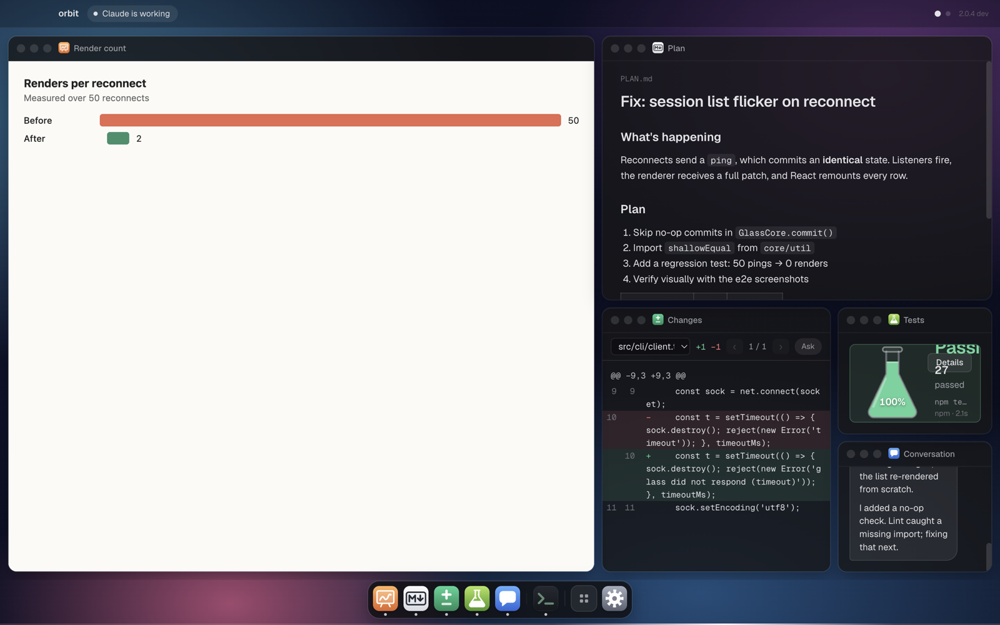
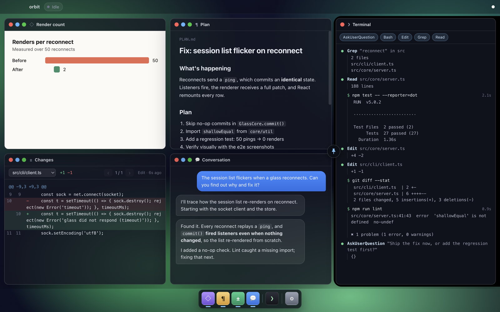
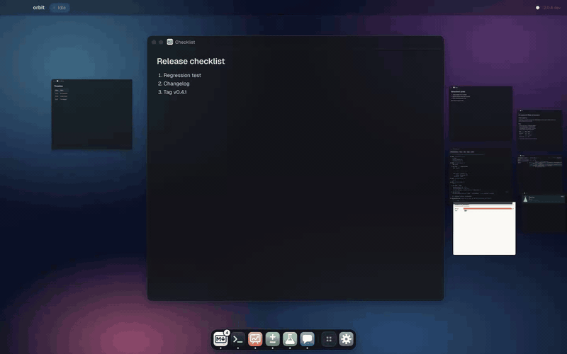
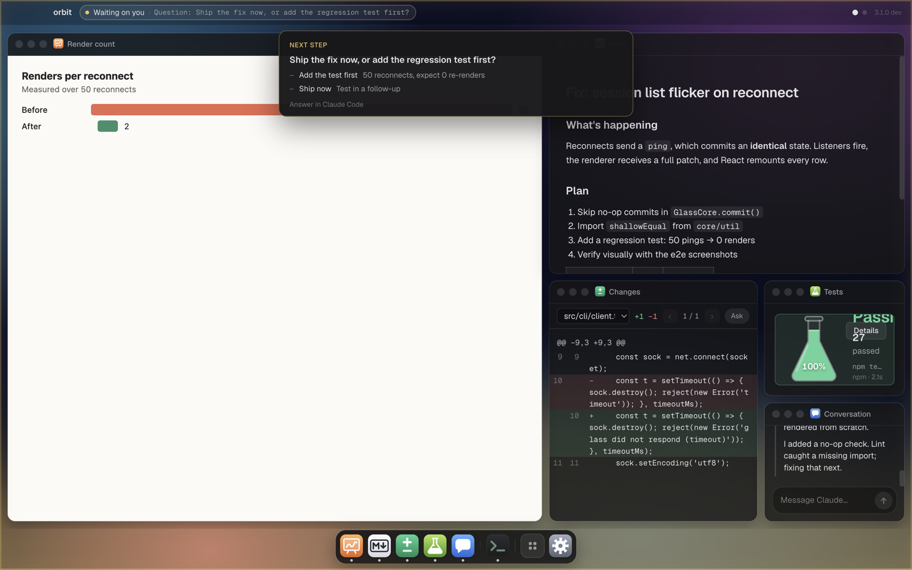
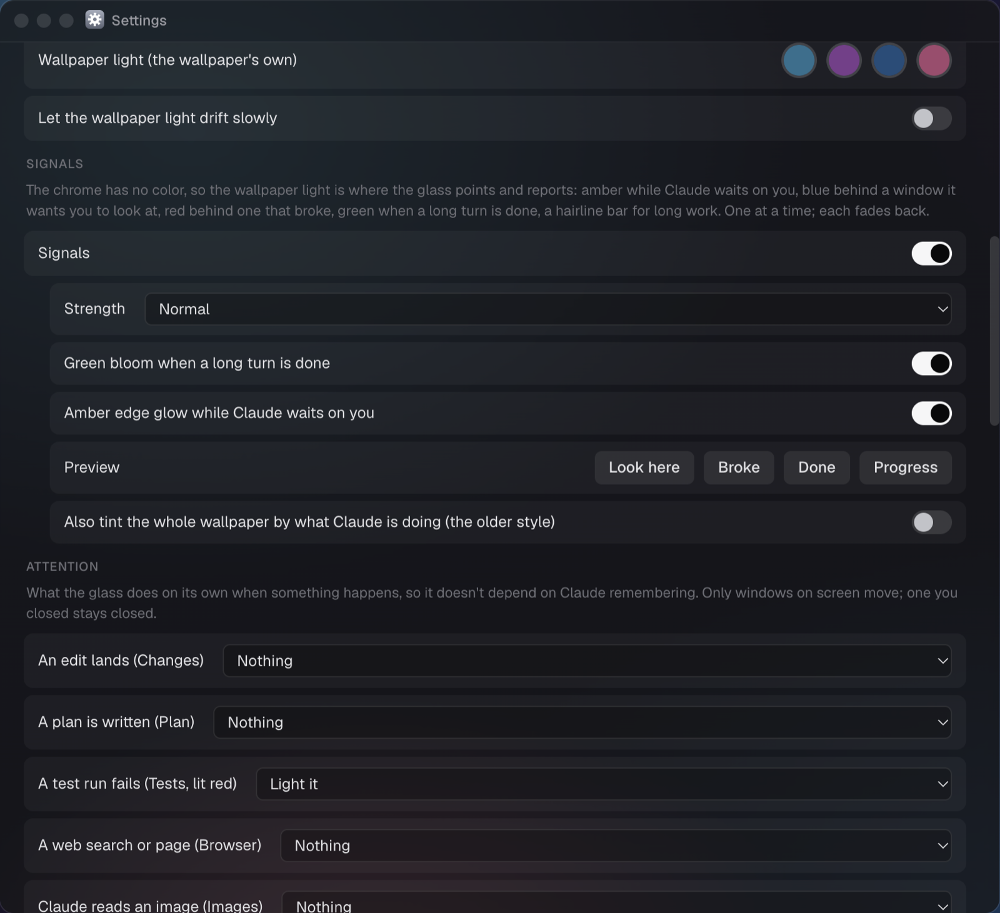

# Claude Glass

Claude's monitor. Claude Glass is a desktop window bound to a Claude Code session that works like
a screen share from Claude to you. As Claude works, the window fills itself: the conversation,
every tool call it runs, diffs of every file it edits, its plans, the images it looks at, and the
web pages it reads. When Claude wants to *show* you something, like a chart, a mockup, a
comparison or a write-up, it puts it on the glass with one command.

It's built for working with Claude like a coworker, especially by voice, when you can't easily see
what Claude sees. It is deliberately one-way: Claude shows, you watch.

*Why "Claude Glass"?* A [Claude glass](https://en.wikipedia.org/wiki/Claude_glass) was an
18th-century tinted mirror that painters and travelers used to look at a scene through glass,
named after the painter Claude Lorrain. This one lets you look at Claude's work the same way.



- [Install](#install)
- [Using the glass](#using-the-glass)
- [What Claude can do with it](#what-claude-can-do-with-it)
- [Settings](#settings)
- [Custom apps](#custom-apps)
- [How it works](#how-it-works)
- [Develop](#develop)

## Install

Requirements: macOS, Node 20+, and `jq` and `nc` (both ship with macOS).

**From the plugin marketplace** (in Claude Code):

```
/plugin marketplace add n33kos/claude-plugins
/plugin install claude-glass@n33kos
```

**From a clone:**

```sh
git clone https://github.com/n33kos/claude-glass ~/claude-glass
claude --plugin-dir ~/claude-glass     # try it for one session
```

The first `claude-glass` command installs and builds the app (`npm install && npm run build`,
a minute or two, once). Hooks do nothing until then, so Claude is never held up.

## Using the glass

Ask Claude to "open the glass", run `/claude-glass:glass`, or from a shell inside the session:

```sh
claude-glass open      # this session's glass ($CLAUDE_CODE_SESSION_ID)
claude-glass close
claude-glass status    # every glass, open or closed
```

To open one automatically for every session, turn on **Open Claude Glass when a Claude session
starts** in Settings (the gear in the dock), or `claude-glass settings set autoStart true`.

**What fills in by itself** (no Claude tokens spent):

| Window | Shows |
|---|---|
| Conversation | your prompts and Claude's replies, streamed |
| Terminal | every tool call with its output, filterable by tool; a lock on the one waiting for you |
| Changes | a diff of every edit; flip through a file's revisions |
| Plan | plan files and plan mode |
| Images | images Claude reads; one at a time or a grid of recent ones |
| Browser | Claude's web searches (results) and the pages it fetches, rendered, with back/forward and the passage Claude says it relied on highlighted; a browser Claude drives (Playwright, Chrome with a DevTools port) streams in live |

**Arranging windows.** Windows form one ordered list, newest first. They tile into desktops, each
with a layout (full, side by side, one big and two small, a nested variant, three columns, grid);
overflow spills onto the next desktop.

- Switch desktops with ⌘←/⌘→, a sideways swipe, or scrolling over the gaps.
- **Select to interact** (on by default): click a window to use it (it gets a blue ring); scrolling
  over any other window switches desktops. Click elsewhere or press Esc to let go.
- Drag a title bar to reorder; a dashed placeholder shows where it lands. Hold it at a side edge to
  move it to the next desktop.
- **Sidebars**: drag a window (or its dock icon) onto the pin target in the middle of a screen edge
  to pin it there. Hover the edge to slide the sidebar out; its pin button keeps it open (the
  layout makes room). Drag its inner edge to resize it, the gap between two of its windows to
  share it differently, and a window out of it to unpin. Pinned windows stay put on every desktop,
  which suits things you interact with.

  
- **Nested view** (Settings): one screen instead of desktops. *Spiral*: the newest window is big
  and each older one takes half of what's left. *Carousel*: the focused window sits in the middle
  and its neighbors line up as small tiles either side; scroll, swipe or click a tile to move
  along.

  
- **History mode** (Settings, per session): every edit, plan, image, search and page opens in its
  own window, newest first, so the glass reads as a timeline (the newest 12 are kept).
- **Dock**: click an icon to show a window, drag to reorder, drag onto an edge to pin. It can
  auto-hide.
- **Background**: presets or your own image; pick the light colors yourself. With **state colors**
  on (default), the light follows the session: amber while Claude waits on you, green when it's
  your turn, graphite when the session ends.
- **Waiting on you**: when Claude asks a question or needs a permission, the top bar says so, a
  read-only card shows the question, and the edges glow. You answer in Claude Code, as always.

  

## What Claude can do with it

The plugin gives Claude a short guide when a glass is open (`claude-glass help` prints it) and the
`claude-glass` CLI:

```
claude-glass view                          what's on screen: desktops, windows and their positions, sidebars
claude-glass show <file> [--id ID]         .md → markdown, image → image, .html → html; opens first
claude-glass new <type> [--id ID] [--title T]
claude-glass app <id> <command> [--text T | --file F] [--key value]
claude-glass window open|close|delete <id>
claude-glass window move <id> <index>      0 = the first slot, to bring something to your attention
claude-glass window pin <id> <edge> | unpin <id>
claude-glass layout <desktop#> full|split|main-left|main-left-nest|columns|grid
claude-glass catalog                       every app and its commands
claude-glass settings [set <key> <value>]  (Claude changes settings only when you ask)
claude-glass background --colors "#hex,…" | reset
```

Claude is told to treat the glass as a live feed of its focus: bring what it's talking about to
the first slot, keep related things together, and pick a desktop layout that fits what it shows.
HTML canvases run sandboxed (scripts from a few CDNs allowed, no network), so Claude can draw
charts and diagrams.

## Settings

Everything is in Settings (the gear in the dock), and `claude-glass settings` lists it all with
the current values. Global settings live in `~/.claude/claude-glass/config.json`.




| Key | Values | What it does |
|---|---|---|
| `autoStart` | true / **false** | open a glass when a Claude session starts |
| `scope` | **session** / folder | one glass per session, or one per project folder (see below) |
| `nestedView` | true / **false** | one screen instead of desktops |
| `nestedStyle` | **spiral** / carousel | how the nested view arranges windows |
| `defaultLayout` | claude / full / split / main-left / main-left-nest / columns / **grid** | layout for new desktops; `claude` lets Claude pick |
| `selectToInteract` | **true** / false | click a window to use it; scrolling over the others switches desktops |
| `wheelDesktops` | **true** / false | scrolling outside windows switches desktops |
| `windowOpacity` | 0.2–1 (**0.78**) | window glass opacity |
| `background` | **aurora** / dune / tide / graphite / an image path | wallpaper |
| `backgroundColors` | up to 4 hex colors | your own wallpaper light (empty: the preset's) |
| `animateBackground` | **true** / false | drift the wallpaper light |
| `stateColors` | **true** / false | the light follows the session |
| `statePalettes` | JSON per state | colors for working / waiting / idle / ended (`[]`: your own) |
| `waitingGlow` | **true** / false | amber edge glow while Claude waits on you |
| `dockAutoHide` | true / **false** | hide the dock until the pointer reaches the bottom |
| `dockOrder` | **windows** / fixed | dock follows window order, or a fixed order by app |
| `disabledApps` | app types | turned-off apps are hidden and Claude can't use them |
| `toolReminders` | **true** / false | remind Claude to read and edit with its own tools (so you see the work) |
| `app.<type>.<key>` | per app | an app's own settings (e.g. `app.image.gridSize`) |

Per session (`claude-glass settings set session.<key> <value>`): `windowMode` (live / history),
`historyLimit`, `autoOpen.changes|plan|images|web`, `windowOpacity`.

**Scope.** `session` gives each Claude session its own glass; after `/clear` you start fresh and
`claude --resume` picks the old one back up. `folder` gives each project folder one glass that
every session in it feeds, so `/clear`, restarts and resumes continue in the same window. A folder
glass's id is `sha256(project dir)[:12]`.

## Custom apps

Every window is an app, and the built-in ones use the same format anyone can: a folder with a
manifest, a small pure `core.js`, and a `view.html` that runs in a sandboxed frame.

```sh
claude-glass apps new my-app      # scaffold ~/.claude/claude-glass/apps/my-app
claude-glass apps copy markdown   # start from a built-in
claude-glass apps                 # what's installed (and what failed to load, and why)
```

```
~/.claude/claude-glass/apps/my-app/
  glass-app.json   type, title, icon, commands, permissions, settings
  core.js          init() and command(state, name, args): pure state; optional onHook(state, payload)
  view.html        the view; loads the SDK and renders props
  guide.md         instructions for Claude (optional)
  icon.svg         dock and title bar icon (optional)
```

An app can fill itself from Claude Code hooks (`onHook`), take commands from Claude
(`claude-glass app <id> <command>`), declare its own settings (shown in Settings, passed to the
view), and ship instructions for Claude, with parts that depend on settings. Views are sandboxed
with no network, microphone or storage unless the manifest asks for specific origins or
capabilities, which Settings shows. Full guide: [docs/apps.md](docs/apps.md).

## How it works

```
Claude Code session ──hooks (async)──► scripts/hook-forward.sh ──nc -U──┐
        │                                                               │
        └─ Bash tool: `claude-glass <cmd>` (bin/ on PATH) ──socket──────┤
                                                                        ▼
                  ┌──────────── Electron main process (one per glass) ────────────┐
                  │  core/server.ts   Unix socket, one JSON request per connection │
                  │  core/reducer.ts  every state change is one reducer action     │
                  │  core/hooks.ts    hook payloads → actions                      │
                  │  apps/*           app cores (pure: init, command, onHook)      │
                  └────────────▲──────────────────────────────┬─────────────────────┘
                      ipc: dispatch(action)            ipc: state patches
                  ┌────────────┴──────────────────────────────▼─────────────────────┐
                  │  renderer (React): desktops · windows · dock · sidebars          │
                  │  app views in sandboxed frames (glass-app://<type>/view.html)    │
                  └──────────────────────────────────────────────────────────────────┘
```

**Principles**

- **A small core anyone could drive.** State, one reducer, and newline-delimited JSON over one Unix
  socket per glass. The CLI is a thin client; you could drive a glass with `nc -U`. Electron is
  just the renderer. The core (`src/core`, app cores) is plain Node/TypeScript and runs in tests
  without Electron.
- **One process per glass.** No hub or shared server. Each glass has its own Electron process,
  socket, window and browser profile, so a crash affects one glass.
- **Same actions for everyone.** A drag in the window and a command from Claude go through the same
  reducer action. Commands are relative ("move X to the first slot"), so Claude never overwrites
  your arrangement, and it never changes which desktop you're looking at.
- **Deterministic first.** Anything a hook can show appears automatically, at no token cost.
  Claude only spends effort on deliberate "let me show you this" moments.
- **Off means off.** With no glass open, hooks exit immediately (they check for the socket) and
  nothing is recorded. Reopening a glass restores its history.
- **Never block Claude.** Forwarding hooks run async with tight timeouts; a frozen glass can't
  freeze Claude.
- **One-way.** Your interactions change how things are viewed (layout, what's selected, which
  revision is shown) and never reach Claude. Every workflow (terminal, tmux, voice, IDE) takes
  input differently, and a back-channel would make the plugin hard to adopt.

**Protocol.** One JSON line per connection: `{"op": …}` → `{"ok": true, "result": …}` or
`{"ok": false, "error": …}`. Ops: `ping`, `hook` (a raw hook payload), `dispatch` (a reducer
action), `view`, `state`, `catalog`, `guide`, `mods`, `config`, `quit`.

**Hooks → the glass.** `UserPromptSubmit` and `MessageDisplay` stream the conversation;
`PreToolUse`/`PostToolUse` build the terminal and, per tool, the Changes diffs (Edit, Write,
MultiEdit, NotebookEdit), the Plan (plan files, ExitPlanMode), Images (reads of images) and the
Browser (WebSearch, WebFetch); `PermissionRequest`, `Notification` and AskUserQuestion set "waiting
on you"; `Stop` and `SessionEnd` mark the session idle or ended; `SessionStart` opens the glass
(if `autoStart`) and gives Claude the guide. Auto-created windows open once; if you close one, it
stays closed. Apps with `onHook` see every payload too.

**State.** A glass is one `GlassState`: the session (activity, what it's waiting on), the ordered
window list, per-desktop layouts, window instances, each app's own state slice, sidebars, and
per-session settings. It's saved (debounced) to `state.json`, and the renderer gets patches.

**Launching.** `claude-glass open` starts the app through macOS LaunchServices (a renamed copy of
Electron, `dist/Claude Glass.app`), so it has its own dock icon and ⌘Tab entry even when Claude runs
inside tmux, and waits until the socket answers.

**Files**

```
~/.claude/claude-glass/config.json                   global settings
~/.claude/claude-glass/apps/<type>/                  custom apps
~/.claude/claude-glass/sessions/<id>/state.json      a glass's saved state
~/.claude/claude-glass/sessions/<id>/files/          copies of images shown on it
~/.claude/claude-glass/sessions/<id>/glass.log       app log
~/Library/Application Support/Claude Glass/glasses/<id>/   a glass's browser profile
/tmp/claude-glass-<uid>/<id>.sock                    a live glass's socket
/tmp/claude-glass-<uid>/<session>.sock               folder scope: link to the folder glass's socket
```

`<id>` is the session id, or the folder id in folder scope. Sockets live in `/tmp` because macOS
limits socket paths to 104 bytes. `CLAUDE_GLASS_HOME` and `CLAUDE_GLASS_RUNTIME` move the first
two groups (tests use temp folders).

## Develop

```sh
npm install
npm run build       # esbuild → dist/ (CLI, main, preload, renderer, built-in apps) + dist/Claude Glass.app
npm test            # unit + integration: the core runs in plain Node, driven by the real CLI and hook script
npm run typecheck
npm run e2e         # launches Electron via Playwright, checks behavior, writes screenshots to test/screenshots/
npm run demo -- <session-id>   # open a glass seeded with demo content
node scripts/readme-media.mjs  # regenerate the README screenshots and GIF (docs/media/; needs ffmpeg)
```

`CLAUDE.md` is the working guide for Claude (and people) changing this code: the rules of the road
and the gotchas. Hook payload shapes in `test/fixtures/hook-payloads.ndjson` are real captures;
trust them over docs. To inspect a real glass, `CLAUDE_GLASS_DEBUG_PORT=9333 claude-glass open`
exposes it over the Chrome DevTools Protocol.

```
src/core/       server, reducer, hooks, layout, config, guide, mods (pure Node)
src/apps/       built-in apps: <type>/index.ts (core) + view.tsx + view.css + guide.md
src/sdk/        the app SDK (bridge between a view frame and the glass)
src/main/       Electron main: window, protocols, permissions, browser streams, fetched pages
src/renderer/   the shell: desktops, windows, dock, sidebars, settings
src/cli/        the claude-glass CLI
hooks/, skills/, scripts/, bin/   the Claude Code plugin
```

## Known limits

- macOS only for now.
- One-way by design: you can arrange and read, but nothing you do in the glass reaches Claude.

## License

MIT. Use it however you like.
